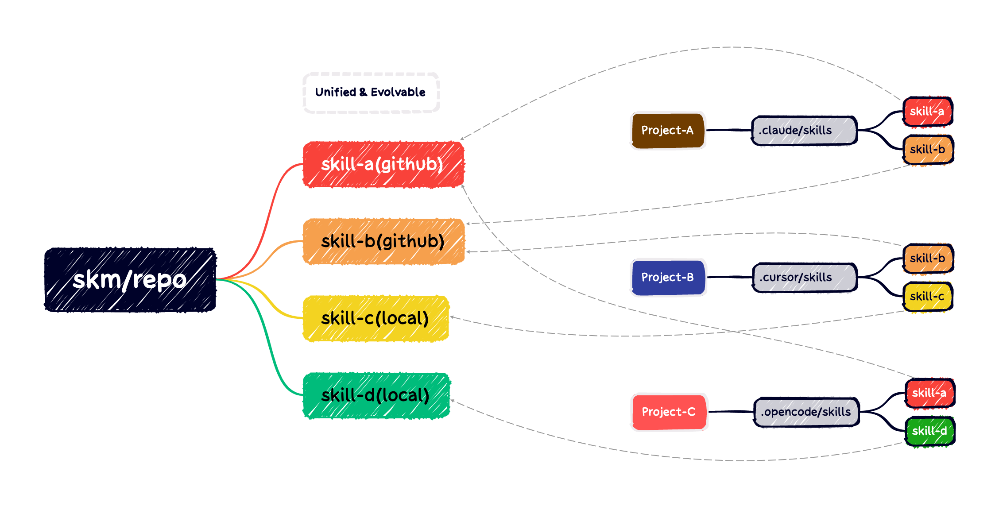

# Skills Management CLI (skm)

[简体中文](./README.zh-CN.md) | English

`skm` is a powerful CLI tool designed to manage and synchronize "skills" (prompt libraries, instruction sets, or capability modules) across various AI coding agents and projects. It serves as a central hub to add skills from GitHub or local directories and selectively link them into your local AI project configurations.

It supports multiple AI environments including **OpenCode**, **Cursor**, **Gemini**, **Antigravity**, **Claude**, and **GitHub** projects.

---

## 🚀 Features

- **Global Skill Repository**: Centralized management of your AI skills.
- **GitHub Integration**: Add skills directly from GitHub repositories or specific subdirectories (sparse checkout).
- **Local Skill Support**: Add skills from local directories for development and debugging.
- **Version Control**: Check for updates and synchronize changes from remote repositories.
- **Project Detection**: Automatically detects the AI project type in your current directory.
- **Symbolic Linking**: Efficiently links skills to projects without duplication, keeping them in sync.
- **Project Isolation**: Manage different sets of skills for different projects.



## 💡 Why skm?

- **Centralized Efficiency**: Skills are cloned only once (`~/.skills-management/repo`) and shared across infinite projects via symbolic links. This saves significant disk space and ensures all your projects use the same curated version of a skill.
- **Precision (Sparse Checkout)**: Only download what you need. If a GitHub repository contains hundreds of skills but you only want one, `skm` uses Git's sparse-checkout to download only that specific subdirectory. No more cloning massive repositories for a single prompt file.
- **Automatic Environment Awareness**: You don't need to know where Cursor, Claude, or OpenCode stores their skills. `skm` automatically detects your project environment and handles the directory structures for you.
- **Clean & Non-Intrusive**: Since skills are symlinked, your project folder stays clean. No extra `.git` folders or heavy files are added to your project's version control.
- **Self-healing**: Proactively detects and helps you clean up broken symbolic links if a global skill is deleted.
- **Version Sync**: Check for remote updates to keep your local "AI brain" sharp.

## 📦 Installation

This tool can be installed directly from npm:

```bash
npm install -g @nnnggel/skills-management
```

Or install from source:

```bash
# Clone the repository
git clone https://github.com/nnnggel/skills-management.git
cd skills-management
npm install
npm run build
npm link
```

## 📖 Usage

Run the tool using `skm`:

```bash
skm
```

### 1. Global Repository Management (`repo`)

Select **"1. repo"** from the main menu to manage your global collection of skills.

#### Add Skill

**GitHub Type**:
- Full repositories: `https://github.com/user/repo` (example: https://github.com/blader/humanizer)
- Specific subfolders: `https://github.com/user/repo/tree/main/path/to/skill` (example: https://github.com/anthropics/skills/tree/main/skills/pdf)

**Local Type**:
- Local directories: `/local/path/to/skill` (example: `~/Desktop/myskill`)

#### Other Operations

- **Update Skills**: Checks for newer commits on the remote GitHub repository and updates your local copy (GitHub type only).
- **Delete Skills**: Remove skills from your global repository.

### 2. Project Skill Management (`list`)

Navigate to your AI project directory and run `skm`. The tool will detect the project type (e.g., `.opencode`, `.cursor`).

Select **"2. list(type)"** to manage skills for the current project.

- **Link/Unlink**: You will see a list of available global skills.
- **Checkbox Interface**: Use `Space` to select or deselect skills, and `Enter` to confirm.
- **Symlinks**: Selected skills are symlinked contents from your global repo into your project's skill directory (e.g., `.opencode/skills/`).

### Supported Project Structures

`skm` automatically detects and installs skills into these directories:

| AI Type | Detected Folder | Skills Installation Path |
|---------|-----------------|--------------------------|
| **OpenCode** | `.opencode` | `.opencode/skills` |
| **Cursor** | `.cursor` | `.cursor/skills` |
| **Gemini** | `.gemini` | `.gemini/skills` |
| **Antigravity** | `.antigravity` | `.antigravity/skills` |
| **Claude** | `.claude` | `.claude/skills` |
| **GitHub** | `.github` | `.github/skills` |

---

## 🏗️ Directory Structure & Internals

`skm` stores its global data and configuration in your home directory at `~/.skills-management`. This architecture ensures that skills are downloaded once and shared across multiple projects.

### Data Layout:

- **`config.json`**: Global configuration file. It stores system-level settings and metadata.
- **`repo/`**: The heart of the management system.
    - **`skills.json`**: The skill registry. It tracks all added skills, their unique IDs, current commit hashes (for version control), and original paths.
    - **`github__[user]__[repo]__[subpath]/`**: Local Git repositories. `skm` flattens the ID (replacing `/` with `__`) to create safe directory names.
    - **Note**: `skm` handles complex paths like `github:user/repo/path/to/skill` by creating a unique folder like `github__user__repo__path__to__skill`.

### Cross-Platform Compatibility (Windows)
`skm` is fully compatible with Windows.
- On **macOS/Linux**, it uses standard symbolic links.
- On **Windows**, it automatically uses **Directory Junctions** (a type of symbolic link for folders) to ensure capability without requiring Administrator privileges or Developer Mode.

---

## 📝 Changelog

### v1.0.2
- Local Skill Support: Add skills directly from local directories
- Menu Navigation Optimization: Unified numeric menu style, added return options, improved terminal compatibility

## 📄 License

ISC
